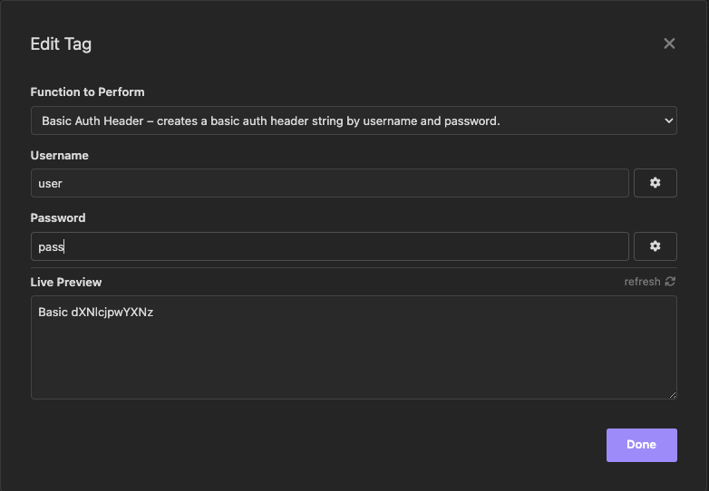

# Base64-Auth-Header Tag

<!-- FIXME show NPM Badge when plugin url is available -->

<!-- FIXME show Github Start Badge when repository public is available -->
<!--  -->

<!-- FIXME show Install methods when plugin url is available -->
## Install

+ In **[Insomnia](https://insomnia.rest)** app
+ Go to `Application` > `Preferences` > `Plugins`
+ Type `insomnia-plugin-basic-auth-header` on input field
+ Click on `Install Plugin`.

## Usage
+ **Using the tag**
    - Press `Ctrl + Space` to insert `Query Parameter`
    - or type `` and click on tag
    - Type *Username* on input field `Username`
    - Type *Password* on input field `Password`

+ **Using the tag (short method)**
    - Type ``

## Screenshot

## License
  